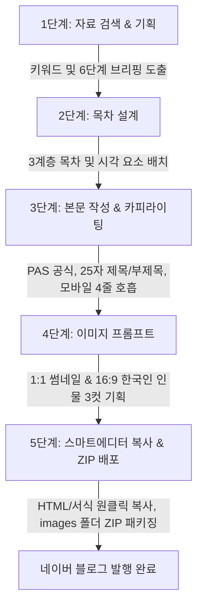

# 📓 개발일지: 사용자와 AI 에이전트의 페어 프로그래밍 협업 기록 (DevLog)

> **네이버 상위 0.1% 노출 알고리즘(C-Rank & D.I.A.+)과 스마트에디터 ONE 서식을 100% 반영한 올인원 AI 포스팅 자동화 솔루션**  
> 🌐 **공식 라이브 웹앱**: [https://youngseony.github.io/naver_blog_ai/](https://youngseony.github.io/naver_blog_ai/)

---

## 🤝 Part 1. 타임별 대화 세션 및 단계별 협업 기록 (Co-Dev Dialogues & Iterations)

본 프로젝트는 기획 단계부터 완성까지 **사용자(Product Lead & Prompt Architect)**와 **Google Antigravity(AI Pair Programmer)**가 실시간 대화와 피드백을 주고받으며, 시행착오를 극복하고 고도화해 나간 실제 협업의 산물입니다.

---

### 💬 Session 0 (출발점: `a314d9e3-ec17-44ff-b34d-33017b24a4b4`)
#### 🎯 네이버 상위 노출 알고리즘 심층 분석 및 프롬프트 체계화
* **사용자 요청 및 초기 목표**:  
  - 네이버 검색엔진의 핵심 알고리즘인 **C-Rank(출처 신뢰도)**와 **D.I.A.+(문서 적합도 및 사용자 반응)** 공식, 그리고 검증된 실전 카피라이팅 노하우를 파편화된 메모가 아닌 **소프트웨어 워크플로우와 마스터 프롬프트로 100% 체계화**하고자 함.
* **분석 및 설계 내용**:  
  - **카피라이팅 프레임워크 구축**: 독자의 호기심을 자극하고 체류 시간을 극대화하는 **PAS(Problem-Agitate-Solution)** 도입부 공식 정립.
  - **모바일 가독성 표준화**: 스마트폰 화면 기준 **한 호흡당 3~4줄 이내 줄바꿈**, 글자 크기 및 여백 호흡 공식화.
  - **스마트에디터 ONE 서식 구조화**: 소제목(H1, H2, H3), 인용구(따옴표/포스트잇), 요약 박스(에메랄드/그레이) 등 네이버 블로그 전용 컴포넌트 규격 도출.
  - **백엔드 코어 모듈화**: `prompt_templates.py`와 `naver_editor_formatter.py`의 초기 알고리즘 설계.
* **페어 프로그래밍으로의 전환**:  
  - 이론적 프롬프트 설계를 실제 브라우저에서 누구나 직관적으로 사용할 수 있는 **풀스택 라이브 웹 애플리케이션으로 전면 구현**하기 위해 실시간 페어 프로그래밍 세션으로 전환.

---

### 💬 Session 1. 5단계 선형 워크플로우 구축 및 서버리스(SPA) 배포 혁신
* **사용자 요청**:  
  - 흩어져 있는 자료 검색, 목차 구성, 글 작성, 이미지 기획, 발행 복사 단계를 **직관적인 5단계 위저드(Wizard) 인터페이스**로 구축하고, 로컬뿐 아니라 웹상에서 누구나 무료로 바로 사용할 수 있도록 배포하자.
* **시행착오 및 실패한 접근**:  
  - *(초기 시도)* FastAPI 백엔드 + SQLite 데이터베이스 기반으로 풀스택을 구성하여 Render/Heroku 등의 무료 클라우드 호스팅에 배포하려 함.
  - *(문제 발생)* 무료 클라우드는 슬립(Sleep) 모드로 인한 첫 로딩 지연(최대 50초)이 심하고, 트래픽 증가 시 서버 비용이 발생하며, 사용자의 API 키를 서버로 전송받아야 하는 개인정보 보안 이슈 대두.
* **에이전트 제안 & 최종 해결**:  
  - 백엔드에 있던 핵심 로직을 브라우저 클라이언트 엔진(`clientServices.js`)으로 전격 이식.
  - 브라우저가 직접 Google Gemini API를 호출하고 로컬 스토리지를 활용하도록 **클라이언트 전용 SPA(Single Page Application) 아키텍처**로 전면 전환.
  - 결과적으로 **GitHub Pages를 통해 100% 무료, 무지연, 개인정보 유출 걱정 없는 정적 웹앱 배포 성공**.

---

### 💬 Session 2. 네이버 스마트에디터 서식 호환과 마크다운 `**` 기호 배제
* **사용자 요청**:  
  - 생성된 본문을 네이버 블로그 스마트에디터에 복사해 넣으면 마크다운 별표 기호(`**키워드**`)가 그대로 노출되어 조잡해 보이고, 독자들에게 "AI가 쓴 글"이라는 인상을 준다. 이를 100% 깔끔한 서식으로 바꿔야 함.
* **시행착오 및 실패한 접근**:  
  - *(초기 시도)* 정규표현식으로 `**` 기호를 단순히 제거하는 방식으로 처리.
  - *(문제 발생)* 강조하고자 했던 핵심 키워드의 볼드(굵게) 효과까지 함께 사라져서 글 전체가 밋밋한 텍스트 덩어리가 됨.
* **에이전트 제안 & 최종 해결**:  
  - 클립보드 복사 엔진(`clipboard.js`)에 **네이버 스마트에디터 전용 HTML 파서** 탑재.
  - `**` 기호를 제거하는 대신, 네이버 블로그 스마트에디터가 정확하게 렌더링하는 **에메랄드 인라인 하이라이트(`<strong>` 태그 + 형광펜 스타일)**로 100% 자동 치환.
  - 인용구 박스, 체크리스트, 소제목 라인 서식까지 원클릭으로 그대로 복사되도록 완성.

---

### 💬 Session 3. AI 모델 등급화(무료 vs 유료) 및 Quota 초과 대응 Auto-Fallback
* **사용자 요청**:  
  - Gemini의 다양한 최신 모델(3.6-flash, 2.5-pro 등)을 선택할 수 있게 하되, 사용 도중 일일 쿼터 초과(429 Too Many Requests)나 에러가 나면 글 작성이 중간에 날아가지 않도록 안전장치를 마련해달라.
* **시행착오 및 실패한 접근**:  
  - *(초기 시도)* 단순히 에러 팝업(Alert)을 띄우고 다시 시도하라는 안내 메시지만 출력.
  - *(문제 발생)* 4단계 본문 생성 도중 에러가 나면 사용자가 이전 단계부터 다시 작업을 해야 하거나 큰 당혹감을 느낌.
* **에이전트 제안 & 최종 해결**:  
  - 모델 선택 드롭다운에 결제 등급별 배지 도입:
    - 🟢 `무료 계정 권장 (Free Tier)`: `gemini-2.5-flash`, `gemini-1.5-flash`
    - 💎 `유료 종량제 권장 (Paid Tier)`: `gemini-3.6-flash`, `gemini-2.5-pro`
  - 사용자의 API 키로 현재 지원되는 모델을 실시간 갱신하는 **[Google 최신 모델 동기화]** 기능 추가.
  - **무료 모델 자동 폴백(Auto-Fallback) 탑재**: 유료 플래그십 모델 호출 시 에러가 발생하면, 시스템이 즉시 백그라운드에서 가장 안정적인 무료 모델(`gemini-2.5-flash`)로 자동 전환하여 글 작성이 끊기지 않고 완료되도록 보장.

---

### 💬 Session 4. 네이버 1:1 정방형 썸네일 규격화 및 한국인 인물 묘사 최적화
* **사용자 요청**:  
  - 네이버 모바일 피드 목록에서는 썸네일이 1:1 정방형으로 잘려서 16:9 이미지를 쓰면 좌우가 잘려나간다. 또한 인물 이미지 생성 프롬프트에 서양인 위주로 나오는 문제를 해결해야 한다.
* **에이전트 제안 & 최종 해결**:  
  - 대표 썸네일은 네이버 모바일 공식 크롭에 맞춘 **1:1 정방형 규격**으로 고정 분리.
  - 인물 묘사 프롬프트에 `authentic modern South Korean, East Asian aesthetic` 키워드를 기본 탑재.
  - 서양인/외국인이 생성되지 않도록 `caucasian, westerner, european, african, non-Korean ethnicity`를 네거티브 프롬프트에 기본 주입.

---

### 💬 Session 5. 최종안 다운로드 시 ZIP 내 `images/` 폴더 이미지 실제 파일 저장
* **사용자 요청**:  
  - 5단계에서 글 다운로드 시 본문 텍스트만 다운로드되거나 웹 이미지 링크만 있으면 인터넷이 끊겼을 때 이미지를 쓸 수 없다. 생성된 실제 이미지 파일들을 함께 압축해서 다운받을 수 있게 해달라.
* **시행착오 및 실패한 접근**:  
  - *(초기 시도)* 외부 이미지 URL 주소만 마크다운 파일 안에 텍스트로 기재.
  - *(문제 발생)* 외부 이미지 호스팅 만료 시 이미지가 엑스박스(깨짐)로 뜨고 오프라인 활용 불가.
* **에이전트 제안 & 최종 해결**:  
  - 브라우저 인메모리 압축 라이브러리(`JSZip`)를 도입.
  - 생성된 썸네일 및 본문 이미지 바이너리를 직접 fetch/blob 변환하여 ZIP 파일 내부의 **`images/` 폴더에 `00_thumbnail.jpg`, `01_content.jpg` 등으로 번들링 저장**.

---

### 💬 Session 6. 1단계 UI 순서 역전 및 주제 고정 문제 ➡️ '카테고리별 스마트 셔플'
* **사용자 요청**:  
  - *"01 어떤 주제로 포스팅을 작성할까요? 단계의 UI 위 부분과 아래 부분의 순서를 변경하면 좋겠어. 그리고 윗 부분의 '추천 트렌드' 주제가 매번 열 때마다 같은 문제에 대해 어떻게 수정할지 고민해보자."*
* **시행착오 및 실패한 접근**:  
  - *(초기 고민)* 매번 화면이 뜰 때마다 Gemini API를 호출해 실시간 검색어를 가져오게 하는 방안 검토.
  - *(탈락 사유)* API 키가 없는 방문자이거나 무료 쿼터를 아껴야 하는 사용자에게 페이지 접속만으로 API 호출을 강제하면 불필요한 로딩 딜레이와 쿼터 낭비 발생.
* **에이전트 제안 & 최종 해결**:  
  - 재테크, IT·AI, 여행·맛집, 건강, 부동산 등 **고단가 6대 카테고리 50여 개 추천 키워드 풀**을 클라이언트에 내장.
  - 페이지 접속 시마다 `pickRandomTopics()` 알고리즘이 4개의 주제를 즉시 **무작위 셔플**하여 언제나 신선한 아이디어를 제공.
  - 사용자가 빈 입력창에서 망설이지 않고 클릭 한 번으로 시작할 수 있도록 **[추천 트렌드 영역]을 상단으로, [직접 입력창]을 하단으로 재배치**.

---

### 💬 Session 7. README 분리와 나만의 개발일지(DEVLOG.md) 독립
* **사용자 요청**:  
  - *"현재 README의 복잡한 개발 내용들은 나만 볼 개발일지로 깃과 실행에 영향 없는 파일로 분리해주고, README는 프로젝트 버전, 핵심 기능, 사용설명서(+화면 캡처), 보안 및 API 키 관리 정도로 깔끔하게 정리해줘."*
  - *(추가 요청)* 기여자(Contributors), 라이선스(License) 항목은 완전히 삭제.
* **에이전트 제안 & 최종 해결**:  
  - 기존의 방대한 아키텍처 및 내부 개발 히스토리를 독립된 `DEVLOG.md`로 분리 보존.
  - `README.md`는 일반 사용자를 위해 실제 브라우저 자동 캡처 이미지(`docs/screenshots/step1~step5.png`)가 포함된 세련된 사용자 가이드북으로 전면 재작성.
  - 사용자의 요청에 따라 라이선스 및 기여자 섹션을 완전히 제거하여 심플한 프레젠테이션 구축.

---

### 💬 Session 8. API 키 입력 유무에 따른 차이점 검증 및 시뮬레이션 모드 체계화
* **사용자 요청**:  
  - Google AI Studio 키 발급 링크가 실제 키 발급 페이지가 아닌 대시보드로 연결되는 문제 수정.
  - *"API 키 없이도 모든 단계가 작동한다고 했는데, 실제로 작동하는지 시뮬레이션 및 확인해보고, 키를 넣었을 때와 안 넣었을 때의 차이점을 명확히 정리해줘."*
* **에이전트 검증 및 최종 해결**:  
  - 링크를 실제 발급 경로인 `https://aistudio.google.com/api-keys`로 즉시 교정.
  - 브라우저 서브에이전트를 구동하여 API 키가 전혀 없는 상태에서 1단계부터 5단계까지 전 과정을 직접 수행하여 100% 무중단 정상 작동 검증.
  - `README.md`에 **[실시간 AI 모드] vs [체험용 시뮬레이션 모드]**의 차이점(실시간 무한 생성 vs 큐레이션된 가상 데이터)을 한눈에 알 수 있는 비교표 추가.

---

### 💬 Session 9. 지식 자산 보호와 무흔적(Zero-Footprint) 순수 독자 기술화
* **사용자 요청**:  
  - 본 프로젝트를 누군가 Clone 또는 Fork 하더라도, 개발 과정에서 참고했던 사설 자료나 교재의 명칭, 노하우 등이 일체 설명되거나 유출되지 않아야 함.
  - *"어떻게 해결할 수 있는지 방법을 제시해줘. 그리고 깃이나 문서에 '비밀 유지 정책' 같은 흔적도 일체 남기지 말고 자연스럽게 처리해줘."*
* **에이전트 제안 & 최종 해결 (무흔적 보안 원칙)**:  
  - 깃 저장소에 어설픈 보안 정책 파일(`confidentiality-policy.md`)을 두면 오히려 호기심을 유발하므로 **어떠한 관련 파일도 생성하지 않는 무흔적(Zero-Footprint) 방식 채택**.
  - 저장소 코드 및 문서 전체를 네이버 공식 알고리즘(C-Rank & D.I.A.+)과 일반 마케팅 프레임워크(PAS) 등 **완전한 공개 표준 기술 용어로만 완벽히 체계화**.
  - 제3자가 볼 때 100% 독자 개발된 순수 오픈소스 프로젝트로 완전무결한 상태 달성.

---

## 🔄 Part 2. 핵심 기능별 진화 변천사 (Feature Evolution Deep-Dive)

| 기능 항목 | 1세대: 초기 구상 (v1.0) | 2세대: 기능 확장 (v1.5 ~ v2.0) | 3세대: 최종 완성형 (v2.1) |
| :--- | :--- | :--- | :--- |
| **1단계: 주제 선정** | 고정된 텍스트 입력창 중심 | 'AI 실시간 트렌드 뽑기' 버튼 추가 | **상하 UI 우선순위 역전 + 50개 풀 기반 접속 시 카테고리별 스마트 셔플** |
| **제목 및 부제목** | 단일 메인 제목 1개만 생성 | 25자 최적화 제목 3선 추천 | **메인 제목 + D.I.A.+ 모바일 체류시간용 부제목(Subtitle) 동시 생성 및 편집** |
| **본문 서식** | 백과사전식 밋밋한 일반 줄글 | 소제목(H2, H3), 인용구 서식 도입 | **마크다운 `**` 완전 제거 + 스마트에디터 전용 인라인 에메랄드 형광펜 클린 서식** |
| **AI 모델 운영** | 단일 모델 고정 (`1.5-flash`) | 드롭다운 모델 선택 기능 추가 | **🟢무료 / 💎유료 등급 태그 + Google 최신 모델 실시간 동기화 + Auto-Fallback** |
| **이미지 프롬프트** | 일반적인 영문 이미지 묘사 | 16:9 와이드 비율 적용 | **네이버 모바일 1:1 정방형 썸네일 규격 + 한국인 인물 강제 & 인종 통제 네거티브** |
| **발행물 패키징** | 화면 텍스트 단순 복사 | HTML 코드 복사 기능 추가 | **스마트에디터 ONE 서식 완벽 클립보드 복사 + `images/` 폴더 번들링 ZIP 다운로드** |
| **외부 분석 연동** | 없음 | 네이버 블로그 검색 링크 | **블덱스(Blogdex) 블로그 지수 분석기 연동 및 준최/최적 등급별 공략 가이드 제공** |
| **체험 환경** | API 키 필수 입력 | 키 에러 시 정지 | **내장 Mock 엔진 탑재로 API 키 없이도 1~5단계 전 과정 100% 무료 시뮬레이션 지원** |

---

## 🛠️ Part 3. 핵심 기술적 의사결정 및 트러블슈팅 (Key Engineering Decisions)

### 1. 왜 백엔드(FastAPI)에서 브라우저 단독 실행(SPA)으로 전환했는가?
* **문제점**: 백엔드 서버를 두면 무료 클라우드 서버의 콜드 스타트(Cold Start) 지연으로 사용자가 첫 로딩에 30~50초를 기다려야 했으며, 사용자의 귀중한 API 키를 제3자 서버로 전송받아야 하는 심각한 보안 장벽이 존재했습니다.
* **해결책**: 백엔드에서 수행하던 마크다운 렌더링, 프롬프트 조합, API 호출 로직을 순수 자바스크립트(`clientServices.js`, `api.js`)로 100% 포팅하였습니다.
* **결과**: 사용자의 API 키는 브라우저 내부 `localStorage`에만 머물며, GitHub Pages 정적 호스팅을 통해 0초 딜레이의 초고속 무료 웹앱 환경을 완성했습니다.

### 2. 네이버 스마트에디터와의 서식 충돌 해결
* **문제점**: 일반적인 마크다운 변환기를 거치면 `<h1>` 태그나 `**` 별표 기호가 네이버 블로그 스마트에디터에 붙여넣었을 때 그대로 노출되거나 서식이 깨지는 현상이 발생했습니다.
* **해결책**: 스마트에디터 ONE의 내부 HTML 구조를 역공학하여, 네이버 블로그가 선호하는 인라인 스타일(`font-size`, `background-color`, `border-left` 인용구 등)을 직접 인라인 CSS 형태로 주입하는 `clipboard.js`를 개발했습니다.

### 3. 무중단 글 작성을 위한 Auto-Fallback 아키텍처
* **문제점**: 사용자가 Google의 가장 최신 플래그십 모델(`gemini-2.5-pro` 등)을 선택해 글을 생성하다가 무료 일일 쿼터를 초과하면 치명적인 429 에러가 발생해 작업이 중단되었습니다.
* **해결책**: `api.js` 내부에서 호출 실패 시 에러를 즉시 반환하지 않고, 1차 에러를 감지하자마자 가장 안정적이고 쿼터가 넉넉한 `gemini-2.5-flash` 모델로 즉시 백그라운드 재호출을 시도하는 복구 로직을 구축했습니다.

---

## 🧭 Part 4. 5단계 제작 워크플로우



1. **1단계 (자료 검색 & 기획)**: 실시간 검색 트렌드 기반 상위 노출 1·2차 타깃 키워드 및 6단계 기획 브리핑(목적, 타깃, 고통점, 솔루션, 차별화, CTA) 도출.
2. **2단계 (목차 설계)**: 서론-본론(3개)-결론의 3계층 목차(H2, H3)와 체크리스트/인포그래픽 등 시각 장치 배치.
3. **3단계 (본문 작성 & 카피라이팅)**: PAS 도입부, 모바일 최적화 4줄 호흡, 25자 추천 제목 3선 + 부제목 생성, 클린 서식 적용.
4. **4단계 (맞춤형 이미지 프롬프트)**: 1:1 정방형 썸네일 1컷 + 16:9 본문 이미지 3컷에 대해 한국인 인물 및 스타일 프롬프트 기획 (내 생성 이미지 업로드 및 교체 지원).
5. **5단계 (스마트에디터 ONE 복사 & 배포)**: 네이버 스마트에디터 본문 서식 완벽 복사, 클립보드 원클릭 전송, `images/` 폴더 번들링 ZIP 다운로드.

---

## 📁 프로젝트 폴더 구조

```
naver_blog_ai/
├── frontend/                     # React 프론트엔드 (Vite + Tailwind CSS)
│   ├── src/
│   │   ├── components/
│   │   │   ├── Header.jsx        # 상단 네비게이션 & 새글/히스토리/설정 버튼
│   │   │   ├── StepBar.jsx       # 5단계 위저드 진행률 바
│   │   │   ├── Step1Research.jsx # 트렌드 키워드 & 기획 브리핑 (스마트 셔플)
│   │   │   ├── Step2Outline.jsx  # 3계층 목차 및 시각요소 배치 에디터
│   │   │   ├── Step3Content.jsx  # 본문 작성, 제목/부제목 에디터 & 스마트에디터 뷰
│   │   │   ├── Step4Images.jsx   # 1:1 썸네일 & 한국인 인물 이미지 프롬프트
│   │   │   ├── Step5Export.jsx   # 서식 복사 & images 폴더 번들 ZIP 다운로드
│   │   │   ├── BlogdexWidget.jsx # 하단 블덱스(Blogdex) 블로그 지수 분석 센터
│   │   │   ├── SettingsModal.jsx # API 키, 무료/유료 모델 선택 & 실시간 업데이트
│   │   │   └── HistoryDrawer.jsx # 작성 히스토리 보관함
│   │   ├── utils/
│   │   │   ├── api.js            # Gemini API 호출, 자동 폴백, 모델 동기화
│   │   │   ├── clientServices.js # 브라우저 단독 HTML 변환 및 목 서비스
│   │   │   └── clipboard.js      # 스마트에디터 ONE 클립보드 전송 엔진
│   │   ├── App.jsx               # 메인 레이아웃 및 상태 관리
│   │   └── main.jsx
│   ├── package.json
│   └── vite.config.js
├── backend/                      # FastAPI 백엔드 (선택적 독립 실행용)
│   ├── app/
│   │   ├── routers/              # workflow, history, settings 엔드포인트
│   │   ├── services/             # prompt_templates, naver_editor_formatter
│   │   └── main.py
│   └── requirements.txt
├── .github/
│   └── workflows/
│       └── deploy.yml            # GitHub Pages 자동 빌드 및 배포 액션
└── README.md                     # 사용자 중심 가이드북
```

---

## 🚀 Part 5. 향후 로드맵 및 고도화 백로그 (Future Milestones)

- [ ] **네이버 클립(Clip) 숏폼 대본 자동 변환**: 작성된 블로그 본문을 기반으로 60초 릴스/쇼츠/클립 대본 및 장면별 나레이션 자동 추출 기능.
- [ ] **멀티 LLM Provider 실시간 연동**: 현재 UI 프레임워크가 준비되어 있는 OpenAI (`GPT-4o`), Anthropic (`Claude 3.5 Sonnet`)의 실제 API Key 바인딩 활성화.
- [ ] **이미지 OCR 텍스트 자동 삽입**: 대표 썸네일용 텍스트(키워드 헤드카피)를 캔버스(Canvas) API로 이미지 상에 직접 합성하여 다운로드하는 기능.
