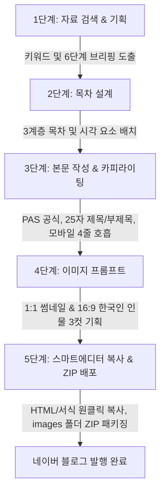

# 🚀 네이버 블로그 AI 자동화 스튜디오 (Naver Blog AI Studio)

> **네이버 상위 0.1% 노출 알고리즘(C-Rank & D.I.A.+)과 스마트에디터 ONE 서식을 100% 반영한 올인원 AI 포스팅 자동화 솔루션**  
> 🌐 **공식 라이브 웹앱**: [https://youngseony.github.io/naver_blog_ai/](https://youngseony.github.io/naver_blog_ai/)

---

## 🌟 핵심 기능 및 주요 업데이트 (v2.0)

### 1. 2026 최신 트렌드 추천 주제 & 유연한 입력 워크플로우
- **동적 연도(2026년) 반영**: 청년 주택드림 청약, 스마트스토어 마진 공식, N잡 부업, 연말정산 절세, 로컬 여행 등 최신 트렌드 주제 풀 탑재.
- **주제 새로고침**: `[다른 추천 주제 보기]` 버튼으로 분야별 트렌드 주제를 원클릭 전환.
- **유연한 듀얼 입력**: '포스팅 주제' 또는 '참고 내용(원문/보도자료)' 중 **하나만 입력해도** AI가 즉시 상위 노출 기획안 도출.

### 2. AI 모델 등급 구분 & 무료 모델 자동 폴백 (Auto-Fallback)
- **결제 등급별 모델 태그 분류**:
  - 🟢 **무료 계정 권장 (Free Tier)**: `gemini-2.5-flash`, `gemini-1.5-flash` (비용 부담 없이 빠르고 안정적인 무료 기본 모델)
  - 💎 **유료 종량제 권장 (Paid Tier)**: `gemini-3.6-flash`, `gemini-2.5-pro`, `gemini-1.5-pro` (심층 추론 및 고성능 플래그십)
- **실시간 Google 모델 동기화**: `[Google 최신 모델 업데이트]` 버튼 클릭 시 사용자의 API 키로 현재 지원되는 최신 Gemini 모델 목록을 실시간으로 가져와 드롭다운에 반영.
- **무료 모델 자동 폴백(Auto-Fallback) 보호**: 사용자가 선택한 유료/신규 모델이 일일 할당량(Quota) 초과나 정책 변경 등으로 호출 실패 시, 시스템이 즉시 **무료 안정화 모델(`gemini-2.5-flash`)**로 자동 전환 재시도하여 글 작성이 끊기지 않도록 보장.
- **멀티 Provider 확장 구조**: 향후 OpenAI ChatGPT (`GPT-4o`), Anthropic Claude (`Claude 3.5 Sonnet`) API 키 입력 시 즉시 연동 가능한 탭 및 어댑터 아키텍처 적용.

### 3. 부제목(Subtitle) 자동 생성 & 스마트에디터 서식 반영
- **D.I.A.+ 가산점 서식**: 메인 제목 확정 시 모바일 첫 화면 체류 시간(Dwell Time)을 극대화하는 **매력적인 1~2줄 부제목** 자동 제안 및 수정 지원.
- **실시간 프리뷰 연동**: 스마트에디터 상단에 세련된 서브타이틀 블록 서식으로 즉시 반영.

### 4. 클린 텍스트 & AI 느낌 주는 `**` 기호 완전 배제
- 인용구, 요약 박스, 본문 내에 AI가 생성한 티가 나는 `**` 별표 마크다운 기호를 전면 제거하고, 네이버 블로그 스마트에디터 전용 인라인 하이라이트(`<strong>` + 에메랄드 형광펜)로 100% 클린 변환.

### 5. 네이버 1:1 표준 규격 & 한국인 인물 이미지 최적화
- **1:1 정방형 썸네일**: 네이버 모바일 검색 및 피드 목록의 공식 1:1 크롭 규격에 정확히 부합하도록 대표 썸네일 기획.
- **한국인 인물 묘사 강제**: 인물이 포함된 프롬프트에 `authentic modern South Korean, East Asian aesthetic` 고정 적용.
- **인종 통제 네거티브 프롬프트**: 서양인/흑인/비동양인 인물이 잘못 생성되지 않도록 `caucasian, westerner, european, african, non-Korean ethnicity, foreign features`를 네거티브에 기본 탑재.

### 6. 최종안 다운로드 시 ZIP 내 `images/` 폴더 이미지 실제 파일 저장
- 글 다운로드 시 본문 마크다운/HTML/제목 텍스트 파일과 함께, 썸네일 및 본문 이미지 실제 바이너리 파일(`00_thumbnail.jpg`, `01_content.jpg` 등)이 ZIP 내 **`images/` 폴더에 완벽히 번들링**되어 바로 사용 가능.

### 7. 웹앱 하단 블덱스(Blogdex) 블로그 지수 분석 센터 연동
- 내 네이버 블로그 아이디 입력으로 [블덱스(blogdex.space)](https://blogdex.space/) 공식 분석 페이지 원클릭 연동.
- **일반 ➡️ 준최 1~7 ➡️ 최적 1~4+** 블로그 등급별 추천 키워드 공략 가이드 제공.

---

## 🧭 5단계 제작 워크플로우



1. **1단계 (자료 검색 & 기획)**: 2026 실시간 검색 트렌드 기반 상위 노출 1·2차 타깃 키워드 및 6단계 기획 브리핑(목적, 타깃, 고통점, 솔루션, 차별화, CTA) 도출.
2. **2단계 (목차 설계)**: 서론-본론(3개)-결론의 3계층 목차(H2, H3)와 체크리스트/인포그래픽 등 시각 장치 배치.
3. **3단계 (본문 작성 & 카피라이팅)**: PAS 도입부, 모바일 최적화 4줄 호흡, 25자 추천 제목 3선 + 부제목 생성, 클린 서식 적용.
4. **4단계 (맞춤형 이미지 프롬프트)**: 1:1 정방형 썸네일 1컷 + 16:9 본문 이미지 3컷에 대해 한국인 인물 및 스타일 프롬프트 기획 (내 생성 이미지 업로드 및 교체 지원).
5. **5단계 (스마트에디터 ONE 복사 & 배포)**: 네이버 스마트에디터 본문 서식 완벽 복사, 클립보드 원클릭 전송, `images/` 폴더 번들링 ZIP 다운로드.

---

## 📁 프로젝트 폴더 구조

```
naver_blog_ai/
├── frontend/                     # React 프론트엔드 (Vite + Tailwind CSS)
│   ├── src/
│   │   ├── components/
│   │   │   ├── Header.jsx        # 상단 네비게이션 & 새글/히스토리/설정 버튼
│   │   │   ├── StepBar.jsx       # 5단계 위저드 진행률 바
│   │   │   ├── Step1Research.jsx # 2026 트렌드 키워드 & 기획 브리핑
│   │   │   ├── Step2Outline.jsx  # 3계층 목차 및 시각요소 배치 에디터
│   │   │   ├── Step3Content.jsx  # 본문 작성, 제목/부제목 에디터 & 스마트에디터 뷰
│   │   │   ├── Step4Images.jsx   # 1:1 썸네일 & 한국인 인물 이미지 프롬프트
│   │   │   ├── Step5Export.jsx   # 서식 복사 & images 폴더 번들 ZIP 다운로드
│   │   │   ├── BlogdexWidget.jsx # 하단 블덱스(Blogdex) 블로그 지수 분석 센터
│   │   │   ├── SettingsModal.jsx # API 키, 무료/유료 모델 선택 & 실시간 업데이트
│   │   │   └── HistoryDrawer.jsx # 작성 히스토리 보관함
│   │   ├── utils/
│   │   │   ├── api.js            # Gemini API 호출, 자동 폴백, 모델 동기화
│   │   │   ├── clientServices.js # 브라우저 단독 HTML 변환 및 목 서비스
│   │   │   └── clipboard.js      # 스마트에디터 ONE 클립보드 전송 엔진
│   │   ├── App.jsx               # 메인 레이아웃 및 상태 관리
│   │   └── main.jsx
│   ├── package.json
│   └── vite.config.js
├── backend/                      # FastAPI 백엔드 (Python, 선택적 독립 실행용)
│   ├── app/
│   │   ├── routers/              # workflow, history, settings 엔드포인트
│   │   ├── services/             # prompt_templates, naver_editor_formatter
│   │   ├── config.py
│   │   ├── database.py           # SQLite 로컬 저장소
│   │   └── main.py
│   └── requirements.txt
├── .github/
│   └── workflows/
│       └── deploy.yml            # GitHub Pages 자동 빌드 및 배포 액션
└── README.md
```

---

## 💻 로컬 개발 환경 실행 방법

### 1. 프론트엔드 실행 (권장)
```bash
cd frontend
npm install
npm run dev
```
- 로컬 개발 서버: `http://localhost:5173`
- 브라우저 단독 모드로 서버 없이도 Gemini API 키를 입력해 모든 기능을 100% 즉시 이용할 수 있습니다.

### 2. 백엔드 실행 (선택 사항)
```bash
cd backend
python -m venv venv

# Windows:
.\venv\Scripts\activate
# Mac/Linux:
source venv/bin/activate

pip install -r requirements.txt
uvicorn app.main:app --reload --port 8000
```
- 백엔드 API 문서: `http://localhost:8000/docs`

---

## 🔒 보안 및 API 키 관리
- 입력하신 Google Gemini API 키는 외부 서버로 전송되지 않으며, 사용자 브라우저의 `localStorage`에만 안전하게 암호화 보관됩니다.
- API 키가 없더라도 시스템 내장 지능형 시뮬레이션 모드를 통해 모든 단계를 무료로 체험하실 수 있습니다.

---

## 👥 기여자 (Contributors)

<div align="center">

| 👤 메인 기획 & 개발 | 🤖 AI 페어 프로그래머 |
| :---: | :---: |
| <a href="https://github.com/youngseony"><br /><sub><b>youngseony (young)</b></sub></a><br />💡 프로젝트 기획 · 아키텍처 · 총괄 개발 | <a href="https://antigravity.google"><br /><sub><b>Google Antigravity</b></sub></a><br />⚡ Gemini 3.8 Flash · 풀스택 AI 어시스턴트 |

</div>

---

## 📄 라이선스
MIT License. 자유롭게 수정 및 배포가 가능합니다.

---

<div align="center">

[](https://antigravity.google)
[](https://ai.google.dev/)

</div>

