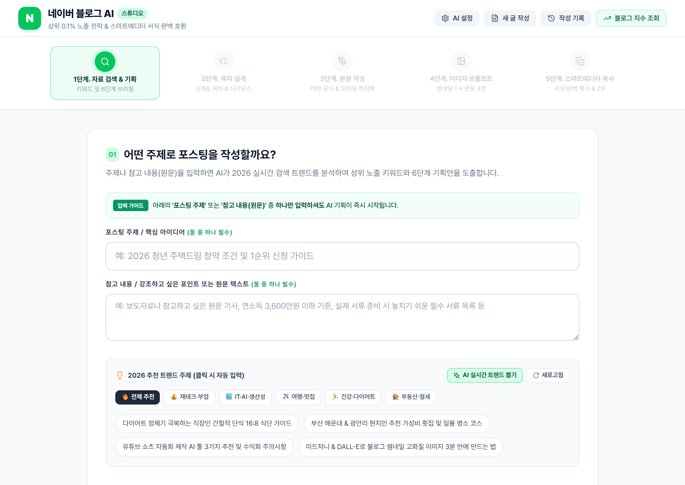
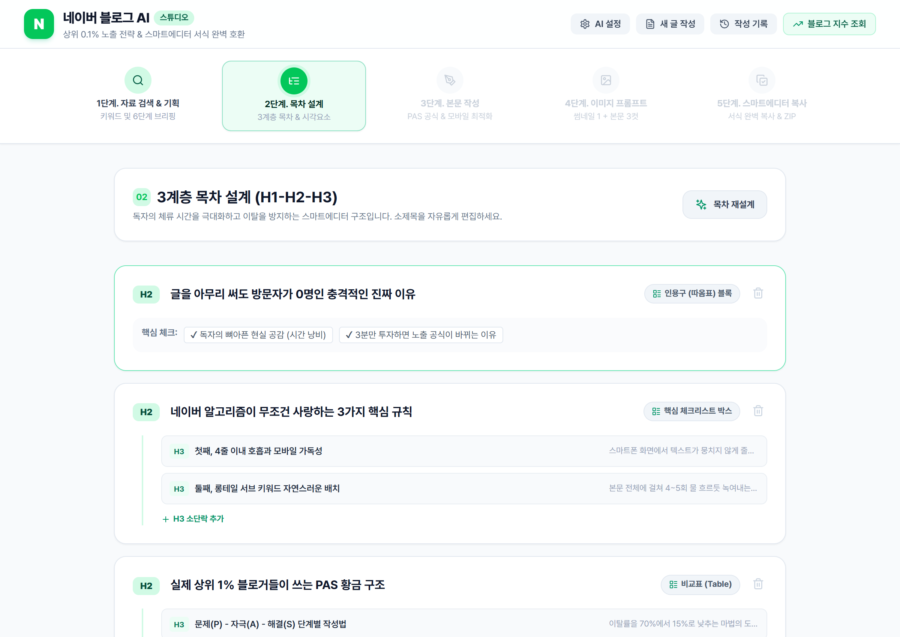
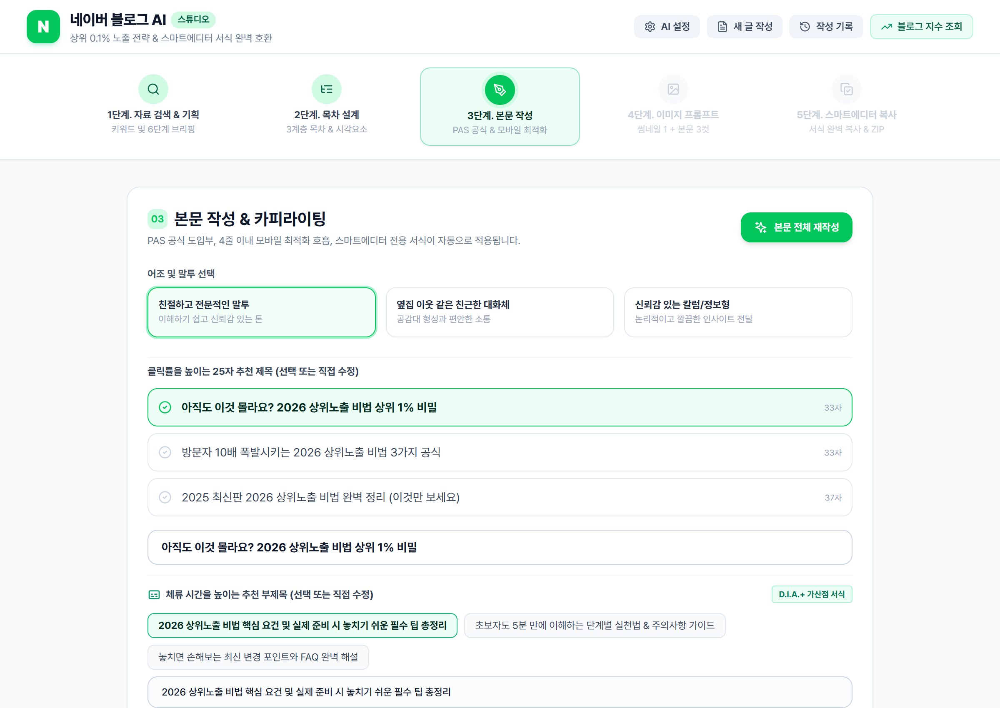
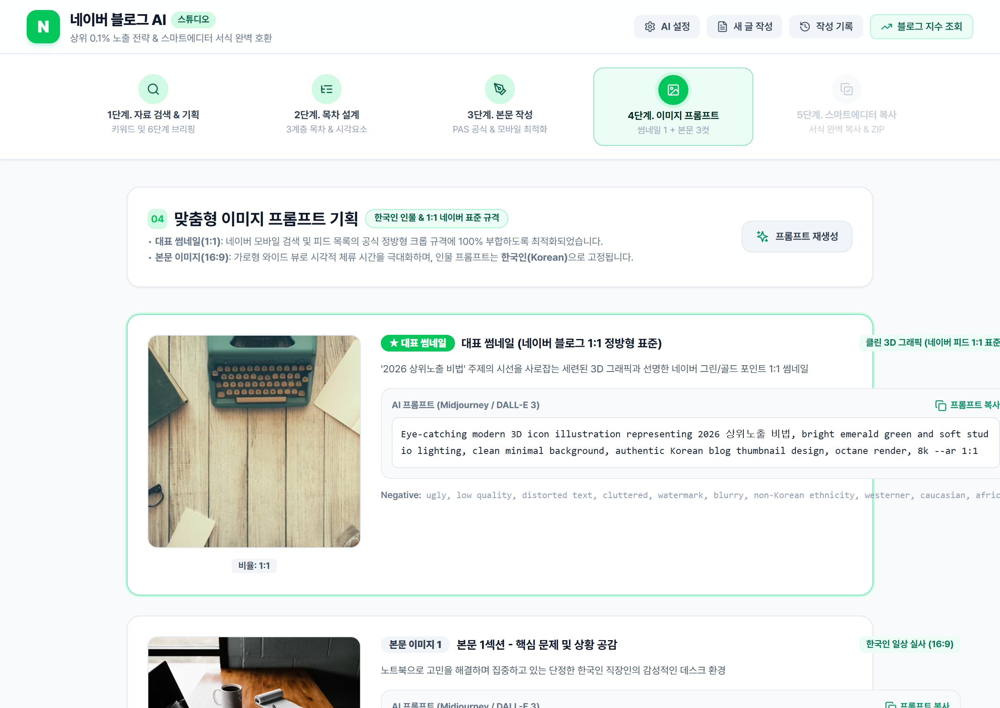
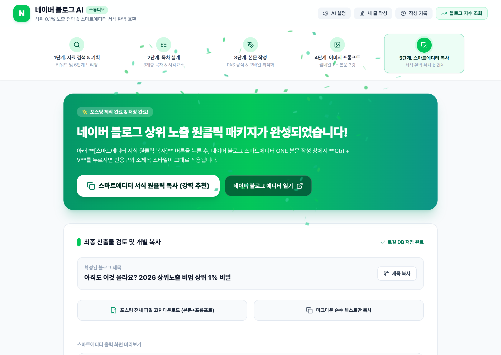

# 🚀 네이버 블로그 AI 자동화 스튜디오 (Naver Blog AI Studio)

> **네이버 상위 0.1% 노출 알고리즘(C-Rank & D.I.A.+)과 스마트에디터 ONE 서식을 100% 반영한 올인원 AI 포스팅 자동화 솔루션**  
> 🌐 **공식 라이브 웹앱**: [https://youngseony.github.io/naver_blog_ai/](https://youngseony.github.io/naver_blog_ai/)

---

## 📌 프로젝트 버전 (Version)
- **현재 버전**: `v2.1`
- **배포 형태**: 브라우저 단독 실행 웹 애플리케이션 (별도 서버 설치 없이 즉시 사용 가능)

---

## 🌟 핵심 기능 (Key Features)

1. **실시간 검색 트렌드 & 카테고리별 스마트 셔플**
   - 최신 고단가 인기 키워드 풀(재테크·부업, IT·AI, 여행·맛집, 건강·다이어트, 부동산·절세 등) 50선 탑재
   - 접속 및 새로고침할 때마다 매번 새로운 추천 주제를 무작위로 추출
   - `[AI 실시간 트렌드 뽑기]` 원클릭으로 오늘 자 실시간 급상승 트렌드 직접 도출
   - '포스팅 주제' 또는 '참고 내용(원문)' 중 하나만 입력해도 AI 기획 자동 시작

2. **D.I.A.+ 가산점 부제목(Subtitle) 자동 생성 & 스마트에디터 서식**
   - 모바일 첫 화면 체류 시간(Dwell Time)을 극대화하는 매력적인 1~2줄 서브타이틀 자동 제안
   - 네이버 블로그 스마트에디터 상단 서브타이틀 블록 서식으로 즉시 변환

3. **클린 텍스트 & AI 흔적(`**` 기호) 완전 배제**
   - 마크다운 특유의 `**` 별표 기호를 전면 제거하고, 네이버 블로그 전용 인라인 강조(`<strong>` + 에메랄드 형광펜)로 100% 변환

4. **네이버 1:1 표준 규격 & 한국인 인물 이미지 최적화**
   - 네이버 모바일 피드 및 검색 목록의 1:1 정방형 썸네일 규격 맞춤 기획
   - 인물 프롬프트에 한국인 미학(`authentic modern South Korean`) 및 비동양인 배제 네거티브 프롬프트 기본 탑재

5. **ZIP 다운로드 시 `images/` 폴더 내 실제 이미지 번들링 저장**
   - 글 다운로드 시 본문 텍스트 파일과 함께 썸네일 및 본문 이미지 파일이 ZIP 내 `images/` 폴더에 완벽히 저장되어 바로 사용 가능

6. **블덱스(Blogdex) 블로그 지수 분석기 링크 제공**
   - 내 네이버 블로그 아이디 입력 시 [블덱스(blogdex.space)](https://blogdex.space/) 공식 분석 페이지로 원클릭 이동
   - 일반 ➡️ 준최 1~7 ➡️ 최적 1~4+ 블로그 등급별 공략 가이드 제공

---

## 🧭 사용 설명서 (5단계 워크플로우)

### 1단계: 자료 검색 & 기획
- 포스팅 주제나 참고하고 싶은 원문 기사/메모를 입력합니다. (아이디어가 없을 때는 하단의 추천 트렌드 주제 칩을 클릭하세요.)
- `[기획 브리핑 & 키워드 도출]` 버튼을 누르면 AI가 검색 트렌드를 분석하여 메인/서브 키워드와 6단계 기획 브리핑(목적, 타깃, 핵심 고민, 솔루션, 차별점, 행동 유도)을 도출합니다.

---

### 2단계: 3계층 목차 설계
- 서론 - 본론(3개 섹션) - 결론의 3계층 목차 구조(H2, H3)를 설계합니다.
- 체크리스트, 요약 박스, 인포그래픽 등 독자 체류 시간을 늘려주는 시각적 장치가 적재적소에 자동 배치됩니다. 필요에 따라 섹션을 추가하거나 직접 수정할 수 있습니다.

---

### 3단계: 본문 작성 & 카피라이팅
- PAS(Problem-Agitate-Solution) 공식과 모바일 가독성에 최적화된 3~4줄 호흡으로 본문이 작성됩니다.
- 추천 제목 3선 중 하나를 선택하거나 직접 수정할 수 있으며, 모바일 클릭률을 높이는 **부제목(Subtitle)**도 함께 제공됩니다.
- 우측 상단 탭을 통해 '스마트에디터 실시간 뷰'와 '마크다운 원문 편집'을 자유롭게 전환할 수 있습니다.

---

### 4단계: 맞춤형 이미지 프롬프트 기획
- 네이버 블로그 모바일 최적 규격인 **1:1 정방형 대표 썸네일 1컷**과 **16:9 본문 시각 자료 3컷**에 대한 상세 영문 프롬프트가 자동 기획됩니다.
- 미드저니, DALL-E 3, ImageFX 등에서 바로 사용할 수 있도록 한국인 인물 묘사 및 네거티브 프롬프트가 포함되어 있습니다.
- 직접 생성한 이미지 파일이 있다면 해당 카드에 업로드하여 즉시 교체할 수 있습니다.

---

### 5단계: 스마트에디터 ONE 복사 & 배포
- **`[스마트에디터 ONE 서식 복사]`** 버튼을 누르면 인용구, 형광펜, 체크리스트, 구분선 서식이 클립보드에 복사됩니다. 네이버 블로그 글쓰기 창에서 `Ctrl + V`로 붙여넣으면 서식이 100% 그대로 적용됩니다.
- **`[패키지 ZIP 다운로드]`** 버튼을 누르면 본문 텍스트 파일들과 함께 생성된 이미지 실제 파일들이 `images/` 폴더에 담겨 압축 파일로 다운로드됩니다.

---

## 🔒 보안 및 API 키 관리 안내

### 1. 철저한 로컬 브라우저 격리 보안
- 사용자가 입력한 Google Gemini API 키는 **어떠한 외부 서버로도 전송되지 않으며**, 오직 사용자의 개인 브라우저 내부 저장소(`localStorage`)에만 안전하게 보관됩니다.
- GitHub Pages 상에서 동작하는 100% 클라이언트 사이드 웹 애플리케이션으로, 개인정보 유출 위험 없이 안심하고 이용하실 수 있습니다.

### 2. Google AI Studio 무료 API 키 발급 방법 (1분 소요)
1. [Google AI Studio API 키 발급 페이지 (https://aistudio.google.com/api-keys)](https://aistudio.google.com/api-keys)에 접속하여 구글 계정으로 로그인합니다.
2. 화면의 **`[Create API key]`** (또는 `[API 키 만들기]`) 버튼을 눌러 새 키를 생성한 후 복사합니다.
3. 웹앱 상단의 **`[⚙️ 설정]`** 아이콘을 클릭하고 복사한 API 키를 붙여넣은 뒤 **`[설정 저장]`**을 누르면 완료됩니다.

### 3. API 키 입력 유의사항 & 무료 모델 자동 보호
- **무료 티어(Free Tier) 완전 무료**: Google Gemini API는 일일 무료 호출 할당량(RPM/RPD)을 넉넉하게 제공하므로, 개인 블로그 작성 용도로는 결제 등록 없이 **완전 무료**로 이용하실 수 있습니다.
- **추천 모델**: 비용 부담 없이 빠르고 안정적인 `gemini-2.5-flash` 모델을 기본 권장합니다.
- **무료 모델 자동 폴백(Auto-Fallback)**: 사용자가 선택한 특정 모델이 Google 정책 변경이나 일일 할당량 초과로 일시적인 오류를 반환하더라도, 시스템이 자동으로 **무료 안정화 모델**로 전환하여 글 작성이 중단되지 않도록 보호합니다.
- **API 키 없이도 체험 가능**: API 키를 입력하지 않더라도 내장된 지능형 시뮬레이션 모드를 통해 모든 단계를 제한 없이 무료로 체험해 보실 수 있습니다.

### 4. 실시간 AI 맞춤 모드 vs 체험용 시뮬레이션 모드 비교
본 스튜디오는 사용자의 편의를 위해 2가지 실행 환경을 모두 지원합니다.

| 구분 | 🟢 실시간 AI 맞춤 모드 (Gemini API 키 등록 시) | ⚪ 체험용 시뮬레이션 모드 (키 미입력 시) |
| :--- | :--- | :--- |
| **작동 엔진** | Google **Gemini 최신 생성 AI** 실시간 심층 추론 | 브라우저 내장 **지능형 시뮬레이션 템플릿 엔진** |
| **본문 맞춤화** | 입력하신 주제·원문 기사·세부 조건이 **100% 반영된 독창적인 실전 맞춤 글** 실시간 집필 | 입력한 키워드가 제목 등에 일부 치환되나, 본문 구조는 **사전 정의된 고품질 정형 템플릿** 형태 |
| **자료/원문 분석** | 보도자료, 통계 데이터 등 **참고 원문 심층 분석 및 사실 기반 글 작성 가능** | 입력된 참고 원문(기사/메모)의 실시간 심층 요약 분석 불가 |
| **이미지 기획** | 해당 글의 구체적인 소주제 장면에 100% 매칭되는 **독창적 고유 프롬프트 4컷** 생성 | 정형화된 네이버 블로그 최적화 표준 프롬프트 샘플 제공 |
| **주요 추천 목적** | **실제 네이버 블로그에 매일 발행할 상위 0.1% 실전 포스팅 제작** | **도구의 5단계 워크플로우와 스마트에디터 ONE 서식을 사전 체험/테스트** |

> 💡 **Tip**: 실제 블로그 발행을 위한 나만의 맞춤 포스팅을 제작하시려면, 비용 걱정 없는 **[Google AI Studio 무료 API 키(Free Tier)](https://aistudio.google.com/api-keys)**를 등록하여 사용하시는 것을 적극 권장합니다.
